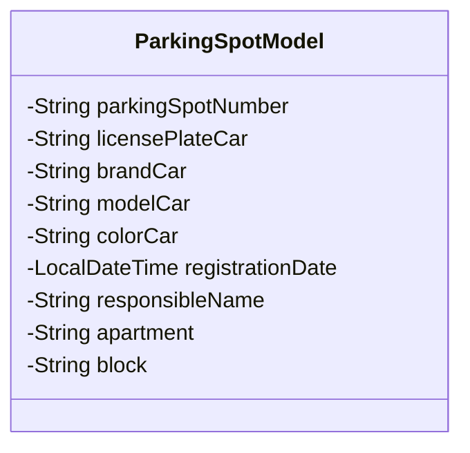

# Santander-Dev-Week-2023
Uma API RESTful em Java foi criada como parte da Santander Dev Week 2023 para oferecer uma solução simples de controle de estacionamento. Esta aplicação foi desenvolvida usando Java 17 e Spring Boot, oferecendo funcionalidades de gerenciamento de estacionamento de veículos.

A aplicação é configurada para funcionar com duas opções de banco de dados. Para ambiente de desenvolvimento, ela utiliza um banco de dados em memória H2, enquanto para o ambiente de produção, o PostgreSQL é empregado para garantir escalabilidade e confiabilidade.

Uma característica notável desta aplicação é que ela foi implantada na nuvem, especificamente na plataforma Railway. Para acessar e explorar o controle de estacionamento, você pode utilizar o seguinte link: [Controle de Estacionamento](https://santander-dev-week-2023-production-f68f.up.railway.app/swagger-ui/index.html)

Além disso, a aplicação inclui documentação interativa da API, disponibilizada através do Swagger UI. Isso facilita a exploração e teste dos endpoints da API de forma conveniente, tornando a interação com a aplicação uma experiência amigável e eficiente.

## Diagrama de classes

